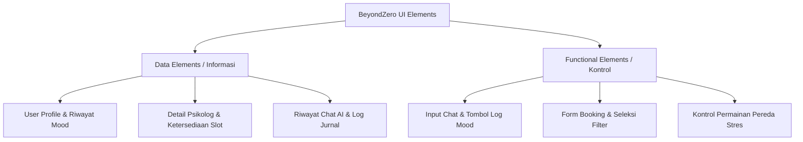

# Dokumen Kebutuhan Desain & Interaction Framework: BeyondZero

Dokumen ini mendefinisikan seluruh kebutuhan desain (*design requirements*) dan kerangka interaksi (*interaction framework*) pada aplikasi kesehatan mental berbasis AI **BeyondZero**, dengan merincikan setiap tahapan proses beserta hasil yang diperoleh.

---

## BAGIAN 1: Definisi Design Requirements

### Tahap 1: Create Problem & Vision Statements
Tahap ini bertujuan untuk merumuskan akar masalah (*problem*) dan arah solusi rancangan (*vision*) secara terstruktur guna menyelaraskan kebutuhan bisnis dan pengguna.

#### A. Problem Statement (Pernyataan Masalah)
Mengikuti format standar template pada slide:
> **Format:** *Company X's customer satisfaction ratings are low. Market share has diminished by 10 percent over the past year because users have inadequate tools to perform tasks X, Y, and Z that would help them meet their goal of G.*

**Penerapan pada BeyondZero:**
> Tingkat kepuasan pengguna platform kesehatan mental **BeyondZero** masih rendah. Retensi aktif pengguna bulanan telah menurun sebesar 10 persen selama setahun terakhir karena pengguna memiliki alat bantu yang tidak memadai untuk melakukan **pelacakan mood harian secara real-time (X)**, **curhat secara privat tanpa hambatan stigma sosial (Y)**, dan **melakukan pemesanan sesi konseling psikolog profesional yang instan (Z)** yang akan membantu mereka mencapai tujuan mereka yaitu **menjaga keseimbangan kesehatan emosional dan mental (G)**.

#### B. Vision Statement (Pernyataan Visi)
Mengikuti format standar template pada slide:
> **Format:** *The new design of Product X will help users achieve G by allowing them to do X, Y, and Z with greater [accuracy, efficiency, and so on], and without problems A, B, and C that they currently experience. This will dramatically improve Company X's customer satisfaction ratings and lead to increased market share.*

**Penerapan pada BeyondZero:**
> Desain baru dari **BeyondZero** akan membantu pengguna mencapai **keseimbangan kesehatan emosional dan mental (G)** dengan memungkinkan mereka melakukan **pelacakan mood otomatis berbasis teks (X)**, **curhat interaktif bersama asisten AI empatik 24/7 (Y)**, dan **reservasi psikolog berlisensi secara real-time (Z)** dengan tingkat **[efisiensi, akurasi pelacakan, kenyamanan interaksi, dan privasi data]** yang lebih tinggi, serta tanpa masalah **stigma sosial (A)**, **biaya awal konseling yang mahal (B)**, dan **proses antrean administrasi manual (C)** yang saat ini mereka alami. Hal ini secara dramatis akan meningkatkan tingkat kepuasan pengguna **BeyondZero** dan mengarah pada peningkatan retensi serta pangsa pasar platform.

---

### Tahap 2: Explore & Brainstorm
Tahap ini mengaitkan visi di atas dengan temuan-temuan dari *user research* yang telah dilakukan sebelumnya guna menghasilkan gagasan fitur konkrit.

| Visi / Target | Hasil User Research | Solusi / Fitur Hasil Brainstorming |
| :--- | :--- | :--- |
| **Pelacakan Mood Real-time (X)** | Pengguna sering malas mencatat mood karena antarmuka yang membosankan dan opsi emosi yang terbatas. | **Rule-Based ML Mood Tracker**: Pengguna cukup menuliskan cerita pendek, AI mendeteksi emosi secara otomatis (*Amazing, Good, Normal, Bad, Awful*) dan memberikan analisis tingkat kepercayaan (*confidence score*). |
| **Curhat Privat Tanpa Stigma (Y)** | Pengguna merasa cemas dan malu jika masalah mereka dihakimi oleh orang lain, tetapi butuh tanggapan cepat di malam hari. | **Curhat AI Chatbot**: Asisten virtual kesehatan mental yang responsif, hangat, tanpa stigma, menggunakan teknologi NLP untuk mendengarkan keluhan pengguna kapan pun dan di mana pun. |
| **Booking Konseling Cepat (Z)** | Pengguna kesulitan memilih psikolog yang cocok dan rumit menjadwalkan konsultasi karena tidak ada transparansi jadwal. | **Ekosistem Booking Psikolog**: Sistem pencarian pintar (*matching system*) berdasarkan spesialisasi psikolog, disertai kalender real-time, pilihan sesi *online/offline*, dan manajemen status yang transparan. |

---

### Tahap 3: Identify Persona Expectation
Menggunakan profil persona pengguna yang didefinisikan dari riset untuk menyaring apa saja ekspektasi utama mereka terhadap produk.

#### **Persona 1: Rian (Mahasiswa Telkom University yang Cemas)**
* **Karakteristik**: Berusia 21 tahun, memiliki beban tugas akademis yang menumpuk, sering mengalami kecemasan mendadak di malam hari, akrab dengan teknologi.
* **Ekspektasi Terhadap Fitur**:
  1. Dapat mencurahkan isi hati secara instan dan rahasia tanpa takut dihakimi (*Curhat AI Chatbot*).
  2. Memerlukan alat bantu pereda stres instan ketika merasa tertekan (*Stress Relief Games*).
  3. Visualisasi grafik mood yang sederhana untuk melihat tren kesehatan mentalnya selama pekan ujian (*Mood Tracker Dashboard*).

#### **Persona 2: Sarah (Dewasa Muda / Fresh Graduate)**
* **Karakteristik**: Berusia 24 tahun, sedang mencari pekerjaan, merasa tertekan secara emosional dan membutuhkan konseling mendalam secara profesional.
* **Ekspektasi Terhadap Fitur**:
  1. Kemudahan mencari psikolog yang sesuai dengan anggaran dan spesialisasi karir/keluarga (*Booking Psikolog*).
  2. Adanya opsi untuk melakukan konsultasi tatap muka langsung (*offline*) maupun jarak jauh (*online*).
  3. Jurnal harian yang terstruktur untuk menulis refleksi diri dan resolusi harian (*Structured Journaling*).

---

### Tahap 4: Construct Context Scenarios
Skenario konteks menggambarkan interaksi persona dengan sistem dalam kehidupan sehari-hari untuk mencapai tujuan mereka.

> **Skenario Konteks: Rian Mengatasi Kecemasan Akademik Sebelum Ujian**
>
> Pukul 23.30 WIB, Rian duduk sendirian di kamarnya dengan cemas. Tugas akhir pemrograman harus dikumpulkan besok pagi, namun programnya masih mengalami *error*. Jantung Rian berdegup kencang dan ia merasa mulai sesak napas karena stres yang menumpuk. Ia tidak ingin mengganggu temannya yang sudah tidur dan merasa sungkan jika harus menghubungi orang tuanya.
>
> Rian mengambil ponselnya dan membuka aplikasi **BeyondZero**. Dari beranda, ia langsung memilih menu **"Curhat AI"**. Rian menuliskan kekhawatirannya: *"Aku stres banget, kodenya error terus padahal besok pagi harus dikumpul. Aku takut ga lulus matkul ini."*
>
> Dalam hitungan detik, asisten AI membalas dengan pesan hangat dan penuh emotif, memvalidasi perasaannya, serta menyarankan agar ia tidak memaksakan diri. AI menawarkan bantuan cepat: *"Rian, wajar sekali merasa tegang. Bagaimana jika kita meredakan ketegangan fisikmu dulu? Cobalah ikuti panduan napas di game stress relief kita selama 3 menit."*
>
> Rian mengklik tautan tersebut dan diarahkan ke fitur **"Stress Relief Game"**. Ia mengikuti instruksi animasi lingkaran pernapasan (Tarik Napas - Tahan - Hembuskan) yang berjalan dengan ritme lambat. Setelah 3 menit, detak jantung Rian kembali normal dan pikirannya menjadi lebih tenang. 
>
> Sebelum menutup ponsel, sistem mendeteksi emosi Rian dan menanyakan: *"Bagaimana perasaanmu sekarang?"*. Rian memilih mood **"Bad"** (telah membaik dari "Awful" sebelumnya) dan menyimpan catatan singkat hari itu. Ia memutuskan untuk beristirahat dan menyelesaikan tugasnya dengan pikiran segar esok hari.

---

### Tahap 5: Identify Design Requirements
Mengekstrak kebutuhan desain dari skenario konteks di atas dengan format: **Action (action) + Object (object) + Context (context)**.

#### **1. Fitur Mood Tracker**
* **Memilih (action)** kategori emosi harian dari emoji **(object)** pada halaman beranda utama saat merasa cemas **(context)**.
* **Melihat (action)** visualisasi grafik statistik tren mood mingguan **(object)** pada dashboard profil pengguna **(context)**.

#### **2. Fitur Curhat AI (Chatbot)**
* **Mengirimkan (action)** pesan teks curahan hati secara bebas **(object)** dalam jendela obrolan pribadi yang responsif **(context)**.
* **Menerima (action)** respons tanggapan suportif dan latihan menenangkan diri **(object)** langsung di dalam sesi percakapan aktif **(context)**.

#### **3. Fitur Structured Journaling**
* **Menulis (action)** aspek bersyukur, pencapaian, dan afirmasi positif **(object)** pada editor jurnal harian terstruktur **(context)**.
* **Menyimpan (action)** draf atau riwayat tulisan jurnal **(object)** ke dalam basis data pribadi dengan aman **(context)**.

#### **4. Fitur Booking Psikolog**
* **Menyaring (action)** profil psikolog berdasarkan spesialisasi, jenis kelamin, dan harga **(object)** di halaman direktori konseling **(context)**.
* **Memesan (action)** slot jadwal janji temu online atau offline **(object)** melalui formulir pemesanan langsung psikolog **(context)**.
* **Membatalkan (action)** reservasi jadwal yang telah diajukan **(object)** dari halaman daftar riwayat pemesanan **(context)**.

#### **5. Fitur Stress Relief Games**
* **Memainkan (action)** game pereda ketegangan otot/pikiran seperti visual napas dalam atau pop-bubble **(object)** pada layar permainan interaktif **(context)**.

---

## BAGIAN 2: Desain Interaction Framework

Interaction framework menerjemahkan kebutuhan desain menjadi struktur halaman, elemen antarmuka, dan alur interaksi pengguna secara keseluruhan.

### Langkah 1: Definisikan Form Factor, Posture, dan Input Method

1. **Form Factor (Faktor Bentuk)**:
   * **Web-based Responsive Web Application**. Mengingat target pengguna menggunakan laptop untuk bekerja/kuliah (menulis jurnal panjang, melakukan sesi video konseling) dan ponsel saat bepergian (melakukan pelacakan mood cepat, melakukan chat AI).
2. **Posture (Postur Aplikasi)**:
   * **Sovereign Posture (Aplikasi Berdaulat) pada Desktop**: Digunakan ketika pengguna sedang berinteraksi secara mendalam, seperti menulis jurnal (*Journaling*), membaca artikel, atau melakukan sesi konsultasi video call dengan psikolog. Antarmuka kaya akan detail, menggunakan ruang layar secara penuh.
   - **Transient Posture (Aplikasi Transien) pada Mobile**: Digunakan untuk interaksi singkat, cepat, dan spesifik, seperti melakukan cek-in mood harian (*quick mood logging*) atau membalas chat AI saat sedang cemas di tempat umum.
3. **Input Method (Metode Input)**:
   * **Desktop**: Keyboard (mengetik jurnal & chat) dan Mouse/Trackpad (navigasi dashboard, pemilihan slot waktu).
   * **Mobile**: Layar sentuh (*Touch Gestures*) untuk memilih emosi dengan emoji, mengetik dengan keyboard virtual, dan kontrol ketukan dalam *Stress Relief Games*.

---

### Langkah 2: Definisikan Elemen Data dan Elemen Fungsional

Elemen-elemen ini dibagi berdasarkan halaman/fitur utama:



#### **A. Elemen Data (Data Elements)**
* **Dashboard & Mood Tracker**:
  * Informasi sapaan personal pengguna (*user greeting*).
  * Data tren emosi mingguan (grafik garis/batang).
  * Riwayat log aktivitas dan persentase mood dominan.
* **Curhat AI**:
  * Balon obrolan pengirim (User) dan penerima (AI).
  * Informasi status bot (*typing...*, *online*).
  * Kategori topik obrolan (akademik, asmara, karir).
* **Booking Psikolog**:
  * Kartu profil psikolog (Foto, Nama, Sertifikasi, Rating).
  * Tabel harga sesi dan spesialisasi masalah.
  * Kalender ketersediaan hari dan slot jam operasional.
  * Daftar riwayat pemesanan beserta status konfirmasi (*Pending, Confirmed, Completed, Cancelled*).
* **Journaling**:
  * Form terstruktur (Kolom input Syukur, Pencapaian, Hambatan, Afirmasi).
  * Daftar kartu arsip jurnal lama berdasarkan tanggal.

#### **B. Elemen Fungsional (Functional Elements)**
* **Dashboard & Mood Tracker**:
  * Tombol aksi cepat *"Bagaimana perasaanmu hari ini?"* dengan pilihan 5 emoji interaktif.
  * Tombol untuk navigasi ke riwayat pelaporan detail.
* **Curhat AI**:
  * Kolom input teks pesan fleksibel (*Expandable Text Area*).
  * Tombol kirim (*Send*) dan tombol untuk mengakhiri sesi chat.
* **Booking Psikolog**:
  * Dropdown filter spesialisasi psikolog dan rentang biaya.
  * Tombol aksi reservasi *"Book Now"*.
  * Tombol pembatalan *"Cancel Booking"* untuk pemesanan berstatus pending/confirmed.
* **Journaling**:
  * Tombol *"Buat Jurnal Baru"*.
  * Formulir interaktif dengan validasi tanggal unik (tidak boleh dobel dalam satu hari).
  * Tombol aksi *"Simpan Jurnal"*, *"Edit"*, dan *"Hapus"*.
* **Stress Relief Games**:
  * Elemen visual interaktif (Canvas lingkaran pernapasan atau balon gelembung pop yang merespons ketukan jari).

---

### Langkah 3: Buat Pengelompokan dan Hierarchy (Navigasi)

Struktur hierarki antarmuka aplikasi dibagi menjadi:
1. **Navigasi Global (Sidebar Desktop / Bottom Nav Mobile)**:
   * **Beranda/Dashboard**: Menampilkan pintasan status cepat, grafik emosi, dan tombol curhat cepat.
   * **Mood & Jurnal**: Mengelompokkan riwayat pencatatan mood dan tulisan refleksi diri harian.
   * **Layanan Konseling**: Mengelompokkan pencarian direktori psikolog dan daftar janji temu.
   * **Fitur AI & Relaksasi**: Pintu masuk ke Curhat AI dan Stress Relief Games.
2. **Hierarki Konten Halaman (Visual Hierarchy)**:
   * Menggunakan ukuran teks besar untuk judul menu utama (`h1`).
   * Tombol *call-to-action* (CTA) utama menggunakan warna aksen cerah/gradient (misal: tombol *"Booking Sekarang"*, *"Mulai Napas Dalam"*).
   * Informasi status krusial (misal status booking: *Pending* - Kuning, *Confirmed* - Hijau, *Cancelled* - Merah) dibedakan dengan label berwarna kontras (*badge color-coding*).

---

### Langkah 4: Sketch Interaction Framework - Key Path Scenario & Storyboarding

Di bawah ini digambarkan alur interaksi kunci (*Key Path*) dalam bentuk skenario alur layar terstruktur (*storyboarding*) untuk 2 tugas utama:

#### **Skenario A: Pengguna Mencatat Jurnal Harian & Mendapat Analisis Sentimen**
```
[Halaman Dashboard]
      │
      ├─► Klik tombol "+ Buat Jurnal Baru" di widget Jurnal.
      │
[Halaman Editor Jurnal]
      │
      ├─► Pengguna mengisi judul dan tanggal hari ini.
      ├─► Memilih Mood Emoji representasi perasaan hari itu.
      ├─► Mengisi kolom terstruktur (Gratitude, Challenge, Reflection).
      ├─► Menekan tombol "Simpan Jurnal".
      │
[Halaman Riwayat Jurnal (Hasil)]
      │
      └─► Sistem menyimpan jurnal, memproses teks dengan NLP ML, dan menampilkan 
          kartu jurnal baru dengan tag sentimen mood otomatis serta pesan tips kesehatan mental.
```

* **Storyboarding Penjelasan Tampilan**:
  1. **Layar 1 (Dashboard)**: Terdapat kartu *widget* jurnal dengan visual ringkasan jurnal terakhir dan tombol besar `+ Tulis Jurnal`.
  2. **Layar 2 (Form Editor)**: Desain form bersih menggunakan panel *glassmorphism*. Di bagian atas ada pemilihan 5 emoji besar. Di bawahnya berderet kolom teks editor berlatar gelap yang nyaman untuk mengetik di malam hari.
  3. **Layar 3 (Popup Berhasil/Toast)**: Setelah menekan simpan, muncul transisi animasi halus tanda centang hijau dengan teks *"Jurnal berhasil disimpan! Selamat berefleksi hari ini."*

#### **Skenario B: Pengguna Melakukan Pemesanan Konseling Psikolog**
```
[Halaman Layanan Psikolog]
      │
      ├─► Pengguna memfilter spesialisasi: "Kecemasan" (Anxiety).
      ├─► Menelusuri kartu profil psikolog berlisensi.
      ├─► Klik tombol "Pilih Jadwal" pada psikolog yang diinginkan.
      │
[Form Booking Psikolog]
      │
      ├─► Memilih Tipe Sesi: "Online" / "Offline".
      ├─► Menentukan tanggal pada kalender interaktif (hari esok dst).
      ├─► Memilih jam yang tersedia (misal: 14.00 - 15.00).
      ├─► Menulis catatan keluhan singkat pada text area.
      ├─► Mengklik tombol "Konfirmasi Pemesanan".
      │
[Halaman Riwayat Pemesanan (Hasil)]
      │
      └─► Pengguna dialihkan ke halaman riwayat booking dengan status pemesanan 
          "Pending" (menunggu persetujuan psikolog). Tombol "Batalkan Jadwal" aktif jika ada perubahan.
```

* **Storyboarding Penjelasan Tampilan**:
  1. **Layar 1 (Direktori)**: Layout grid menampilkan barisan kartu psikolog. Setiap kartu menonjolkan nama, rating bintang, dan tag spesialisasi (misal: *Depresi, Karir*).
  2. **Layar 2 (Modal Booking)**: Dialog modal melayang di atas layar dengan kalender visual (tanggal yang penuh akan berwarna abu-abu dan tidak dapat diklik). Pilihan jam ditampilkan dalam bentuk tombol-tombol pill (*time-slots*).
  3. **Layar 3 (Riwayat Booking)**: Tabel daftar pemesanan menampilkan detail janji temu terbaru di baris paling atas, dengan warna indikator status kuning berkedip lembut untuk melambangkan proses konfirmasi.
